
BLUE ARCHIVE PET · PERSONAL ART COLLECTION

<h1 align="center">碧蓝档案的桌面伙伴</h1>

一位认真应援，一位安静待命。 猫冢响与飞鸟马时，把各自的小小日常带到桌面上。

<b>02 款桌宠 &nbsp; / &nbsp; 各 09 种动作 &nbsp; / &nbsp; 各 16 个跟随方向</b>

<a href="#认识她们">认识她们</a> &nbsp; · &nbsp; <a href="#动作剧场">动作剧场</a> &nbsp; · &nbsp; <a href="#创作收藏">创作收藏</a> &nbsp; · &nbsp; <a href="#下载与收藏">下载收藏</a> &nbsp; · &nbsp; <a href="#来源与署名">来源署名</a>

## 宣传网站

[打开收藏入口](https://blue-archive-desktop-companions.mibxranime.chatgpt.site/) · [响的应援手册](https://blue-archive-desktop-companions.mibxranime.chatgpt.site/hibiki.html) · [时的任务档案](https://blue-archive-desktop-companions.mibxranime.chatgpt.site/toki.html)

网站使用 Sites 托管，目前仅所有者可访问。两位角色各有独立页面、背景故事、透明高清主视觉、九动作与十六方向互动，以及可查看的 Agent 安装指令和直接下载入口。[网站源码与运行说明](site/README.md)。

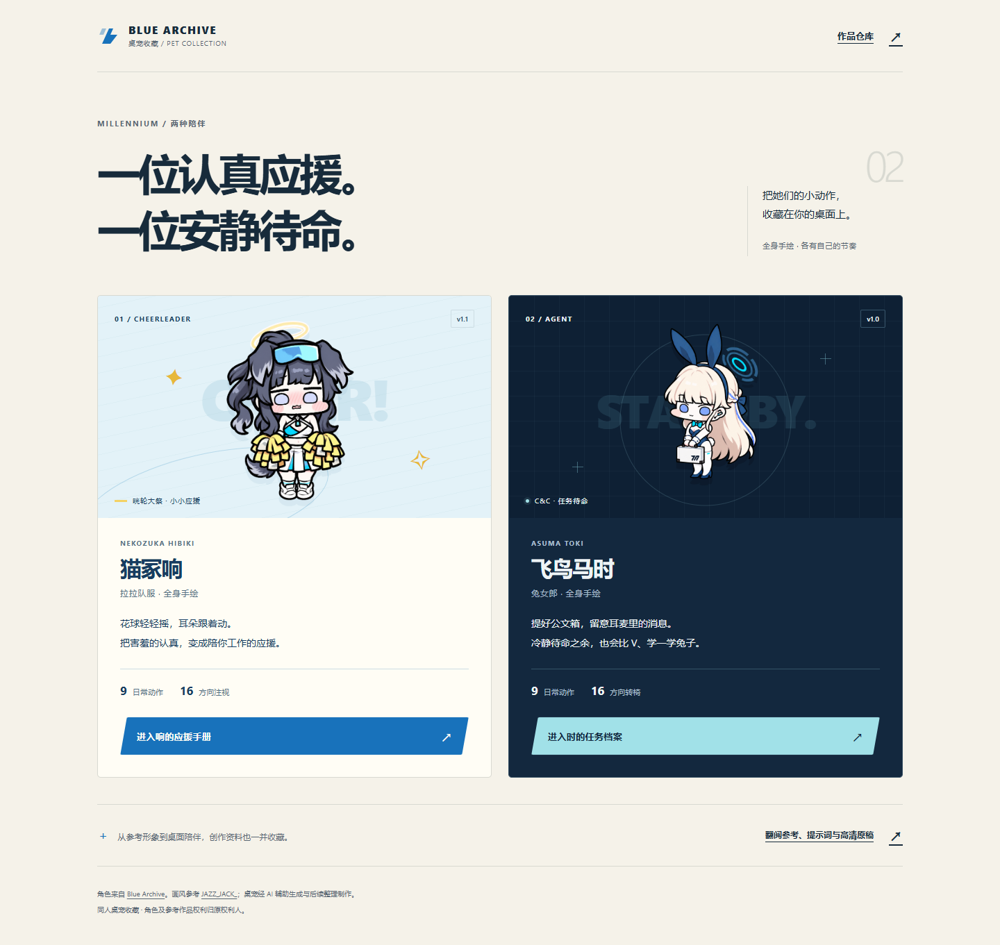

## 认识她们

<table>
<tr>
<td align="center" width="50%">HIBIKI · CHEERLEADER<h3>拉拉队响</h3>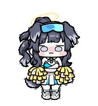
有一点害羞，也会很认真地为你加油。

<b>v1.1</b> · <a href="pets/hibiki-cheerleader-fullbody-handdrawn/README.md">看看响的日常</a> · <a href="https://github.com/MIBXR/blue-archive-pet/releases/download/v1.1-hibiki-cheerleader-fullbody-handdrawn/hibiki-cheerleader-fullbody-handdrawn-portable.zip">下载 ZIP</a>
</td>
<td align="center" width="50%">TOKI · BUNNY<h3>兔女郎时</h3>
冷静待命，偶尔也会得意地比个 V。

<b>v1.0</b> · <a href="pets/toki-bunny-fullbody-handdrawn/README.md">看看时的日常</a> · <a href="https://github.com/MIBXR/blue-archive-pet/releases/download/v1.0-toki-bunny-fullbody-handdrawn/toki-bunny-fullbody-handdrawn-portable.zip">下载 ZIP</a>
</td>
</tr>
</table>

### 猫冢响 · 拉拉队服全身手绘

把猫冢响的拉拉队服形象做成一只二头身桌宠。灰黑长发、软软的狗耳、额前青蓝护目镜和淡金光环，配上蓝白制服与黄白花球；粗细略有起伏的深色线条、浅紫色眼睛，保留她有些害羞的神情。

她平时把花球放低，安静眨眼；等你时把两只花球拢到胸前，失落时又会拿它们遮住脸。轮到工作状态，就认真跳起一段带星星的应援舞。

| 形象 | 表情 | 动作里的小道具 |
| --- | --- | --- |
| 二头身全身、狗耳与尾巴、蓝白拉拉队服 | 浅紫眼睛、脸颊排线与害羞的小嘴 | 两只黄白花球、额前护目镜、淡金光环 |

### 飞鸟马时 · 兔女郎全身手绘

**飞鸟马时-兔女郎全身手绘风格**保留浅金长发、蓝紫椭圆眼与深蓝兔女郎装。她双手交叉提着带有千禧标志的白色公文箱，冷静认真地接收耳麦信息；问候时会举起双手比 V，学兔子时俯身、摆出兔爪，跟随视线时则坐上转椅。

| 形象 | 表情 | 动作里的小道具 |
| --- | --- | --- |
| 全身手绘、浅金长发、深蓝兔女郎装与分段光环 | 蓝紫椭圆眼、冷静神情与偶尔得意的笑容 | 千禧标志公文箱、左耳耳麦、武器与转椅 |

## 动作剧场

每款都完整展示九种日常动作与十六方向跟随。GIF 来自各自的成品图集；点击动图可以单独查看，实际触发与播放节奏由桌宠应用决定。

### 01 · 拉拉队响

九种日常动作全部展开，并附完整的十六方向注视。点击动图可以单独查看。

<table>
<tr>
<td align="center" width="33%"><b>01 · 待机</b> <a href="pets/hibiki-cheerleader-fullbody-handdrawn/package/previews/idle.gif">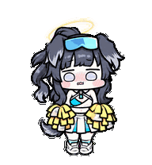</a> 花球放低，带着害羞的神情眨眼。</td>
<td align="center" width="33%"><b>02 · 向右跑</b> <a href="pets/hibiki-cheerleader-fullbody-handdrawn/package/previews/running-right.gif">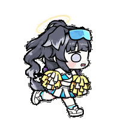</a> 抱好花球，朝右迈开小步。</td>
<td align="center" width="33%"><b>03 · 向左跑</b> <a href="pets/hibiki-cheerleader-fullbody-handdrawn/package/previews/running-left.gif">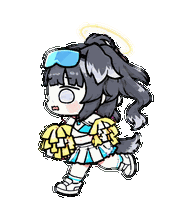</a> 朝左出发，耳朵和尾巴跟着动。</td>
</tr>
<tr>
<td align="center" width="33%"><b>04 · 挥手</b>  举起一只花球，和你打招呼。</td>
<td align="center" width="33%"><b>05 · 跳跃</b> <a href="pets/hibiki-cheerleader-fullbody-handdrawn/package/previews/jumping.gif">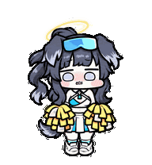</a> 花球一起抬起，轻轻跳一下。</td>
<td align="center" width="33%"><b>06 · 失落</b> <a href="pets/hibiki-cheerleader-fullbody-handdrawn/package/previews/failed.gif">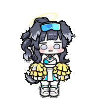</a> 低下头，用花球挡住害羞的脸。</td>
</tr>
<tr>
<td align="center" width="33%"><b>07 · 等待回应</b> <a href="pets/hibiki-cheerleader-fullbody-handdrawn/package/previews/waiting.gif">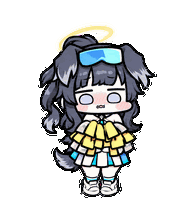</a> 把花球拢在胸前，抬头等回应。</td>
<td align="center" width="33%"><b>08 · 应援 · 工作状态</b> <a href="pets/hibiki-cheerleader-fullbody-handdrawn/package/previews/running.gif">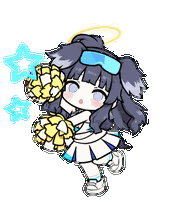</a> 左右摆花球，跳起时亮出星星。</td>
<td align="center" width="33%"><b>09 · 检查与思考</b>  看看两只花球，再满意地点头。</td>
</tr>
</table>

<table>
<tr>
<td align="center" width="33%"><b>10 · 十六方向注视</b> <a href="pets/hibiki-cheerleader-fullbody-handdrawn/package/previews/look-directions.gif">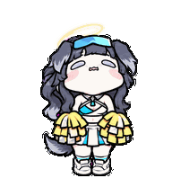</a></td>
<td><b>抬头、转向，再低头看看。</b>  身体、花球与双脚保持正面站姿，脸部逐步俯仰和转向；浅紫色眼睛保持原来的画法，以头脸角度表达方向。  GIF 从上方开始，按顺时针依次展示 16 个方向。实际跟随与动作触发由桌宠应用决定。</td>
</tr>
</table>

#### 一段小小的应援

**向左摆动 → 收回 → 向右摆动 → 蹲下蓄力 → 跳起 → 落地。**

v1.1 的工作动作按这六拍展开。侧摆时出现蓝色星星，跳起时黄色星形在身后绽开；耳朵、尾巴和花球一起跟随动作，最后回到可以继续循环的站姿。

[看看这段动作的提示词](pets/hibiki-cheerleader-fullbody-handdrawn/creation/prompts/running.md) · [查看高清生成原稿](pets/hibiki-cheerleader-fullbody-handdrawn/materials/running.png) · [查看动作与表情参考](pets/hibiki-cheerleader-fullbody-handdrawn/creation/README.md#应援动作与表情)

### 02 · 兔女郎时

<table>
<tr>
<td align="center" width="33%"><b>01 · 待机</b>  双手交叉提着公文箱，安静地眨眨眼。</td>
<td align="center" width="33%"><b>02 · 向右走</b> <a href="pets/toki-bunny-fullbody-handdrawn/package/previews/states/running-right.gif">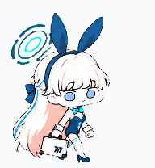</a> 右手提好公文箱，迈开紧凑的小步。</td>
<td align="center" width="33%"><b>03 · 向左走</b> <a href="pets/toki-bunny-fullbody-handdrawn/package/previews/states/running-left.gif">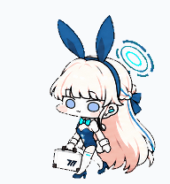</a> 换个方向，提着箱子继续前行。</td>
</tr>
<tr>
<td align="center" width="33%"><b>04 · 比 V 问候</b>  举起双手比 V，露出一点得意的神情。</td>
<td align="center" width="33%"><b>05 · 学兔子</b> <a href="pets/toki-bunny-fullbody-handdrawn/package/previews/states/jumping.gif">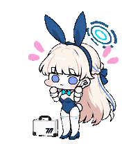</a> 双手模仿兔爪，俯身后轻轻左右摇摆。</td>
<td align="center" width="33%"><b>06 · 失落</b>  垂下眼睛，叹一口气，再恢复站姿。</td>
</tr>
<tr>
<td align="center" width="33%"><b>07 · 等待回应</b> <a href="pets/toki-bunny-fullbody-handdrawn/package/previews/states/waiting.gif">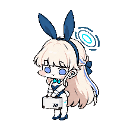</a> 一手提箱，一手询问，稍作停顿等你。</td>
<td align="center" width="33%"><b>08 · 工作</b> <a href="pets/toki-bunny-fullbody-handdrawn/package/previews/states/running.gif">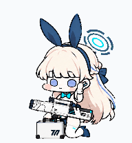</a> 轻触耳麦接收信息，点头后整理武器。</td>
<td align="center" width="33%"><b>09 · 检查与确认</b>  认真查看，再用小小的表情给出回应。</td>
</tr>
</table>

<table>
<tr>
<td align="center" width="33%"><b>10 · 十六方向转椅跟随</b> <a href="pets/toki-bunny-fullbody-handdrawn/package/previews/chair-follow.gif">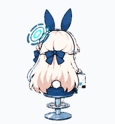</a></td>
<td><b>坐上转椅，转过身来陪你。</b>  十六个方向使用坐姿与转椅表现跟随，依次展示不同朝向。  GIF 用于欣赏已保存的方向姿态，实际跟随方式由桌宠应用决定。</td>
</tr>
</table>

“学兔子”是一段脚不离地的俯身与侧摇动作，配上粉色动效；“工作”则把接收耳麦信息、点头和整理武器连成一段小小的日常。

[看全部动作串联 GIF](pets/toki-bunny-fullbody-handdrawn/package/previews/all-states.gif) · [看动作视频](pets/toki-bunny-fullbody-handdrawn/package/previews/all-states.mp4) · [看待机与学兔子的串联](pets/toki-bunny-fullbody-handdrawn/package/previews/idle-bunny-idle.gif) · [查看动作静帧](pets/toki-bunny-fullbody-handdrawn/package/previews/motion-stills.png)

## 创作收藏

作品由 Codex 与 AI 生图辅助完成。这里同时保存成品与制作时采用的资料：从角色参考和每个动作的想法，到实际提示词、高清原稿，再到透明图集。

| 想看什么 | 拉拉队响 | 兔女郎时 |
| --- | --- | --- |
| 制作来源、参考与动作想法 | [制作记录](pets/hibiki-cheerleader-fullbody-handdrawn/creation/README.md) | [制作记录](pets/toki-bunny-fullbody-handdrawn/creation/README.md) |
| 实际使用的角色与动作提示词 | [提示词收藏](pets/hibiki-cheerleader-fullbody-handdrawn/creation/prompts/) | [提示词收藏](pets/toki-bunny-fullbody-handdrawn/creation/prompts/) |
| 采用的参考图片 | [参考收藏](pets/hibiki-cheerleader-fullbody-handdrawn/creation/references/) | [参考收藏](pets/toki-bunny-fullbody-handdrawn/creation/references/) |
| 高清生成原稿与关键素材 | [高清素材](pets/hibiki-cheerleader-fullbody-handdrawn/materials/) | [高清素材](pets/toki-bunny-fullbody-handdrawn/materials/) |
| 最终图集、桌宠信息与逐动作 GIF | [解包成品](pets/hibiki-cheerleader-fullbody-handdrawn/package/README.md) | [解包成品](pets/toki-bunny-fullbody-handdrawn/package/README.md) |

## 下载与收藏

| 作品 | 当前版本 | 便携包 | 发布记录 |
| --- | --- | --- | --- |
| 猫冢响-拉拉队服全身手绘风格 | v1.1 | [下载 ZIP](https://github.com/MIBXR/blue-archive-pet/releases/download/v1.1-hibiki-cheerleader-fullbody-handdrawn/hibiki-cheerleader-fullbody-handdrawn-portable.zip) | [版本详情](https://github.com/MIBXR/blue-archive-pet/releases/tag/v1.1-hibiki-cheerleader-fullbody-handdrawn) |
| 飞鸟马时-兔女郎全身手绘风格 | v1.0 | [下载 ZIP](https://github.com/MIBXR/blue-archive-pet/releases/download/v1.0-toki-bunny-fullbody-handdrawn/toki-bunny-fullbody-handdrawn-portable.zip) | [版本详情](https://github.com/MIBXR/blue-archive-pet/releases/tag/v1.0-toki-bunny-fullbody-handdrawn) |

便携包包含 sprite v2 正式图集、必要的桌宠信息、使用说明和逐动作预览；将完整文件夹交给支持该格式的桌宠应用或 Agent 导入。两款作品分别保存版本，旧版可在[全部发布](https://github.com/MIBXR/blue-archive-pet/releases)中查看。

## 来源与署名

角色为《碧蓝档案 / Blue Archive》中的猫冢响（Nekozuka Hibiki）与飞鸟马时（Asuma Toki）。两款桌宠的手绘风格参考均来自插画家 [JAZZ_JACK_](https://x.com/JAZZ_JACK_)；这一来源由收藏者补充确认。角色设定、其他参考插画、动作及表情截图按各自来源保存，尚未核实的单张素材不另行推定作者。

桌宠通过 AI 辅助生成与后续整理制作，JAZZ_JACK_ 的署名对应风格参考作品。角色及参考作品的权利归原权利人。
