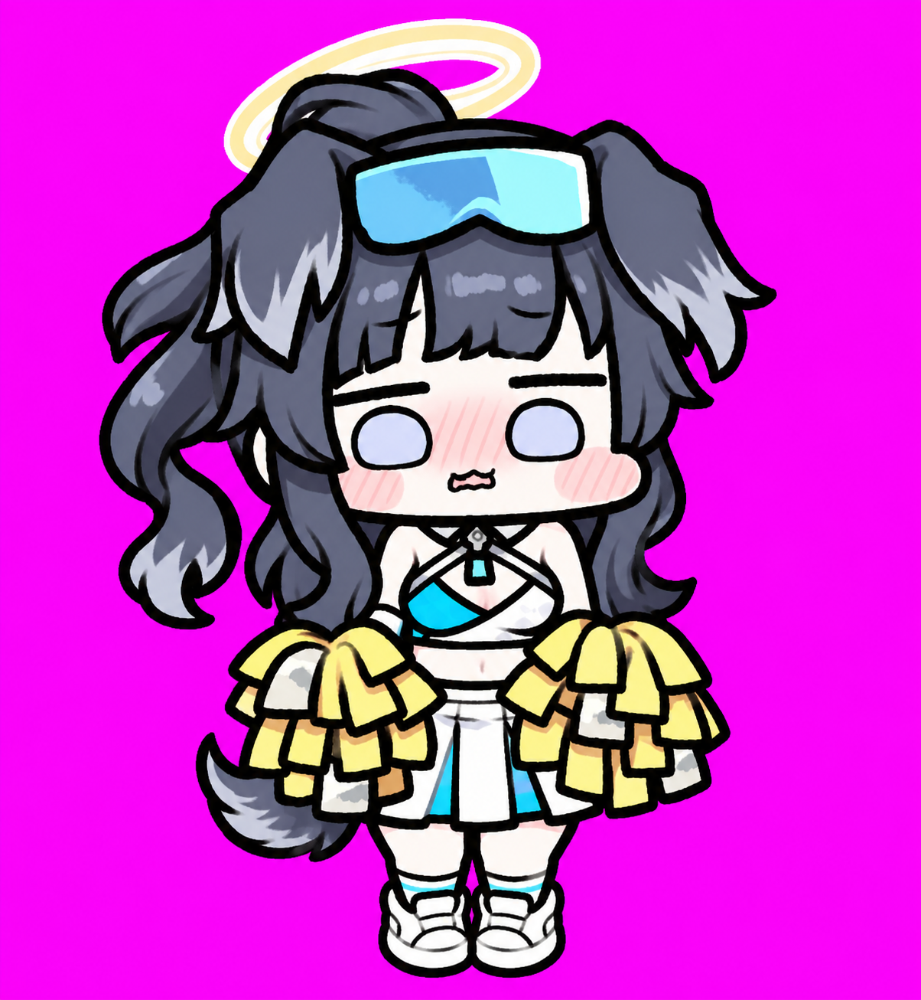

BEHIND THE PET

<h1 align="center">猫冢响 · 拉拉队服全身手绘 · 制作记录</h1>

从一张参考图，到桌面上的小动作。

<b>v1.1 &nbsp; / &nbsp; 参考 · 提示词 · 高清原稿 · 成品</b>

<a href="../README.md">看作品</a> &nbsp; · &nbsp; <a href="#动作设计与原稿">动作设计</a> &nbsp; · &nbsp; <a href="prompts/character.md">角色提示词</a> &nbsp; · &nbsp; <a href="../package/spritesheet.png">成品图集</a>

## 形象从哪里来

把猫冢响的拉拉队服形象做成一只二头身桌宠。灰黑长发、软软的狗耳、额前青蓝护目镜和淡金光环，配上蓝白制服与黄白花球；粗细略有起伏的深色线条、浅紫色眼睛和脸颊排线，保留她有些害羞的神情。

角色为《蔚蓝档案 / Blue Archive》中的猫冢响（Nekozuka Hibiki）。制作参考包括收藏的角色插画、手绘风格图，以及应援动作和表情截图；部分插画作者尚未确认。桌宠通过 AI 辅助生成与后续整理制作；角色及参考作品的权利归原权利人。

<table>
<tr><td align="center" width="50%"><b>采用的主形象</b> </td><td align="center" width="50%"><b>成品中的日常姿态</b> </td></tr>
</table>

## 想保留下来的细节

**完整的应援形象。** 狗耳、马尾、尾巴、护目镜与光环，围绕小小的全身轮廓保留下来。

**花球贯穿日常。** 打招呼、等待、失落与检查，都由手中的两只花球参与表达。

**认真为你加油。** 工作状态是一段应援舞：左右摆花球，蓄力跳起，蓝色与黄色星星跟着登场。

## 制作思路

先从参考中确定角色特征与手绘表达，保存[主形象提示词](prompts/character.md)和采用的角色主图。随后按动作分别生成连续姿态：日常动作保留各自的节奏，注视动作围绕同一套身体构图变化。

生成阶段的高清图保存在 `materials/`，对应提示词保存在 `prompts/`。作品经过透明处理、选帧、位置与配色调整后，成为 `package/` 中的最终图集；下表把每个动作的想法、原稿和最终表现放在一起。原稿保留生成时的状态，部分可见用于去背景的纯色底。

## 动作设计与原稿

| 动作与成品 | 制作思路 | 提示词与高清原稿 |
| :---: | --- | --- |
| **待机**  6 帧 | 以主形象的低位花球站姿为起点，用眨眼与细小表情变化表现安静陪伴。 | [提示词](prompts/idle.md) [高清原稿](../materials/idle.png) |
| **向右跑**  8 帧 | 保留手持花球的完整向右跑姿，步态、马尾和狗耳一起表达移动方向。 | [提示词](prompts/running-right.md) [高清原稿](../materials/running-right.png) |
| **向左跑**  8 帧 | 保存独立的向左跑姿，让护目镜、制服与花球在侧向轮廓中仍然清楚可辨。 | [提示词](prompts/running-left.md) [高清原稿](../materials/running-left.png) |
| **挥手**  4 帧 | 把一只花球举到脸旁再放下，让挥手成为符合拉拉队形象的招呼动作。 | [提示词](prompts/waving.md) [高清原稿](../materials/waving.png) |
| **跳跃**  5 帧 | 抬起两只花球、离地、落回原处，形成一个短小直接的跳跃动作。 | [提示词](prompts/jumping.md) [高清原稿](../materials/jumping.png) |
| **失落**  8 帧 | 耳朵下垂、轻轻低头，再将花球拢到脸颊附近遮住害羞表情，停顿后逐步恢复。 | [提示词](prompts/failed.md) [高清原稿](../materials/failed.png) |
| **等待回应**  6 帧 | 两只花球靠拢在低胸位置，抬头、歪头和眨眼表达期待；保持脸和嘴部可见。 | [提示词](prompts/waiting.md) [高清原稿](../materials/waiting.png) |
| **应援 · 工作状态**  6 帧 | 按“向左摆动 → 收回 → 向右摆动 → 蹲下蓄力 → 跳起 → 落地”组织六拍；侧摆配蓝色星星，跳起与落地配黄色星形。 | [提示词](prompts/running.md) [高清原稿](../materials/running.png) |
| **检查与思考**  6 帧 | 先查看两侧花球，再把画面右侧花球稍稍举到眼前，最后闭眼点头并回到低位站姿。 | [提示词](prompts/review.md) [高清原稿](../materials/review.png) |
| **十六方向注视**  16 个方向姿态 | 身体、花球与双脚保持正面站姿，脸部逐步俯仰和转向；浅紫色眼睛保持原来的画法，以头脸角度表达方向。从上方起，按每 22.5° 顺时针排列。 | [前八方向提示词](prompts/look-row-9.md) [前八方向原稿](../materials/look-row-9.png) [后八方向提示词](prompts/look-row-10.md) [后八方向原稿](../materials/look-row-10.png) |

### 应援动作的六拍

**向左摆 → 收回 → 向右摆 → 蹲下蓄力 → 跳起 → 落地。**

这段动作让“正在工作”变成一场小小的应援。蓝色星星出现在左右侧摆时；黄色星形在起跳时从身后展开，落地时延续余韵。花球、耳朵与尾巴跟随身体，保持原有的害羞表情和粗线条。它与普通的短跳跃分别保存，各有自己的节奏。

## 参考收藏

### 形象与画风

- [角色形象参考](references/reference-01.jpg)
- [手绘风格参考](references/reference-02.jpg)
- [采用的角色主形象](references/canonical-base.png)
- [制作新动作时使用的既有图集](references/previous-design-atlas.png)

### 应援动作与表情

- [应援动作参考拼板](references/official-motion-board.png)
- [应援表情参考拼板](references/official-expression-board.png)

### 注视方向

- [采用的方向姿态参考](references/look-anchors-approved.png)
- [前八方向角色特征板](references/identity-pair-look-row-9.png)
- [后八方向角色特征板](references/identity-board-look-row-10.png)
- [后八方向姿态参考](references/cardinal-left-focus-look-row-10.png)

[透明高清主图](../materials/main.png)也保存在素材目录，方便单独欣赏完整形象。

展开原始插画与动作截图

**角色插画**

[参考 01](references/source-illustrations/01.jpg) · [参考 02](references/source-illustrations/02.png) · [参考 03](references/source-illustrations/03.jpg) · [参考 04](references/source-illustrations/04.jpg) · [参考 05](references/source-illustrations/05.jpg) · [参考 06](references/source-illustrations/06.jpg)

**应援动作截图**

[姿态 01](references/motion-stills/01.jpg) · [姿态 02](references/motion-stills/02.jpg) · [姿态 03](references/motion-stills/03.jpg) · [姿态 04](references/motion-stills/04.jpg) · [姿态 05](references/motion-stills/05.jpg) · [姿态 06](references/motion-stills/06.jpg) · [姿态 07](references/motion-stills/07.jpg) · [姿态 08](references/motion-stills/08.jpg) · [姿态 09](references/motion-stills/09.jpg)

## 当前作品

v1.1 采用应援动作与表情参考，重新绘制工作状态：左右摆花球、收回蓄力、跳起和落地，并加入蓝色侧摆星星与黄色跳跃星形。其他动作沿用已有成品。

[看完整作品](../README.md) · [高清原稿](../materials/) · [解包成品](../package/README.md)
