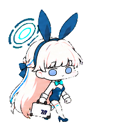

TOKI · BUNNY GIRL

<h1 align="center">飞鸟马时 · 兔女郎全身手绘</h1>

提好公文箱，认真待命；偶尔也会得意地比个 V。

<b>v1.0 &nbsp; / &nbsp; 9 种日常动作 &nbsp; / &nbsp; 16 个转椅跟随方向</b>

<a href="#全部动作">完整动作</a> &nbsp; · &nbsp; <a href="creation/README.md">创作记录</a> &nbsp; · &nbsp; <a href="materials/README.md">高清原稿</a> &nbsp; · &nbsp; <a href="https://github.com/MIBXR/blue-archive-pets/releases/download/v1.0-toki-bunny-fullbody-handdrawn/toki-bunny-fullbody-handdrawn-portable.zip">下载 ZIP</a>

浅金长发、蓝紫色椭圆眼睛、深蓝兔女郎装与分段光环，收进小小的全身轮廓里。她双手交叉提着千禧标志公文箱，工作时认真接收耳麦信息；放松下来，也会模仿兔爪摇晃，或者坐上转椅陪你工作。

## 她的模样

**冷静的待命姿态。** 奶油浅金色头发、圆润脸颊与短腿比例，以用户确认的主形象为准。

**公文箱贯穿日常。** 待机时双手交叉提箱，行走时改为本人右手侧提，随朝向保留不同的遮挡关系。

**认真之余的小表情。** 双 V、兔爪、略带得意的神情，以及转椅上的十六个跟随方向。

## 全部动作

九种日常动作全部展开，随后是完整的转椅跟随预览。下方 APNG（`.png`）由 v1.0 正式透明图集逐格提取，保持每格 192×208 原像素与原播放节奏，可以点击单独查看。

<table>
<tr>
<td align="center" width="33%"><b>01 · 待机</b>  双手交叉提着公文箱，安静站好，再轻轻眨眼。</td>
<td align="center" width="33%"><b>02 · 向右走</b>  右手在身体右侧提箱，迈着紧凑的小步向右走。</td>
<td align="center" width="33%"><b>03 · 向左走</b>  朝左出发，右手提箱藏在身体较远的一侧。</td>
</tr>
<tr>
<td align="center" width="33%"><b>04 · 双 V 问候</b>  举起双手比 V，配上星星和一点得意的神情。</td>
<td align="center" width="33%"><b>05 · 学兔子</b>  模仿兔爪，俯身左右摇晃，粉色动效跟着出现。</td>
<td align="center" width="33%"><b>06 · 失落</b>  垂下眼睛、弯起一只兔耳，轻轻叹气后恢复站姿。</td>
</tr>
<tr>
<td align="center" width="33%"><b>07 · 等待回应</b>  一手提箱，一手询问，停下来等你的回应。</td>
<td align="center" width="33%"><b>08 · 接收信息 · 工作状态</b>  轻触左耳麦、接收信息，再整理手中的武器。</td>
<td align="center" width="33%"><b>09 · 检查结果</b>  认真查看，露出确认完成的神情。</td>
</tr>
</table>

<table>
<tr>
<td align="center" width="33%"><b>10 · 十六方向转椅跟随</b> </td>
<td><b>坐上转椅，转向你所在的方向。</b>  完整保留制作时确认的十六格转椅动作，按方向顺序依次展示。  动图用于欣赏整组姿态；应用内的跟随、停留与触发由 ChatGPT Pets 控制。</td>
</tr>
</table>

[全动作 APNG](package/previews/all-states.png) · [透明 GIF 兼容版](package/previews/all-states.gif) · [历史 MP4 视频](package/previews/all-states.mp4) · [待机—学兔子—待机 APNG](package/previews/idle-bunny-idle.png) · [衔接 GIF](package/previews/idle-bunny-idle.gif) · [转椅 GIF](package/previews/chair-follow.gif) · [动作静帧](package/previews/motion-stills.png)

APNG 完整保留图集的 RGBA 与半透明边缘，适合浅色和深色页面。每个动作同时提供同名透明 GIF；GIF 只支持二值透明，细软边缘以 APNG 为准。静帧也是原尺寸透明 PNG。

`jumping` 在这一款中表现为脚不离地的学兔子动作，`running` 表现为接收信息和整理武器；左右行走使用各自的独立状态。

## 从参考到成品

| 想看什么 | 从这里开始 |
| --- | --- |
| 参考分工、动作设计与制作说明 | [创作记录](creation/README.md) |
| 原始参考、服装与动作资料 | [参考收藏](creation/references/README.md) |
| 制作目录保留的提示词 | [提示词收藏](creation/prompts/README.md) |
| 采用的动作源图、生成原件与设计图 | [高清素材](materials/README.md) |
| 最终图集、桌宠信息和安装方式 | [解包成品](package/README.md) |

这一版保存用户提供的首个正式版本。创作中间稿按用途收录，不另编造早期版本或开发日期。正式图集与 `pet.json` 保持原样；当前仓库的透明预览由正式图集重新导出，单独改善展示效果。v1.0 历史 Release ZIP 保持原发布字节，包内预览仍为历史版本；MP4 也保留原文件。归档时已从交付元数据中移除源环境的宠物 ID 与历史启用状态。

[查看 v1.0 发布页](https://github.com/MIBXR/blue-archive-pets/releases/tag/v1.0-toki-bunny-fullbody-handdrawn) · [浏览全部发布](https://github.com/MIBXR/blue-archive-pets/releases)

## 来源与署名

角色为《碧蓝档案 / Blue Archive》中的飞鸟马时（Asuma Toki），采用兔女郎服装。用户确认本款与猫冢响桌宠的画风参考均来自插画家 [JAZZ JACK（@JAZZ_JACK_）](https://x.com/JAZZ_JACK_)；具体参考图与用途见[参考收藏](creation/references/README.md)。

桌宠由 AI 辅助生成并经选帧、透明处理和图集整理制作。原插画用于风格参考，不代表插画家创作、参与或认可本桌宠；角色和参考作品的权利归相应权利人。

[返回作品首页](../../README.md)
